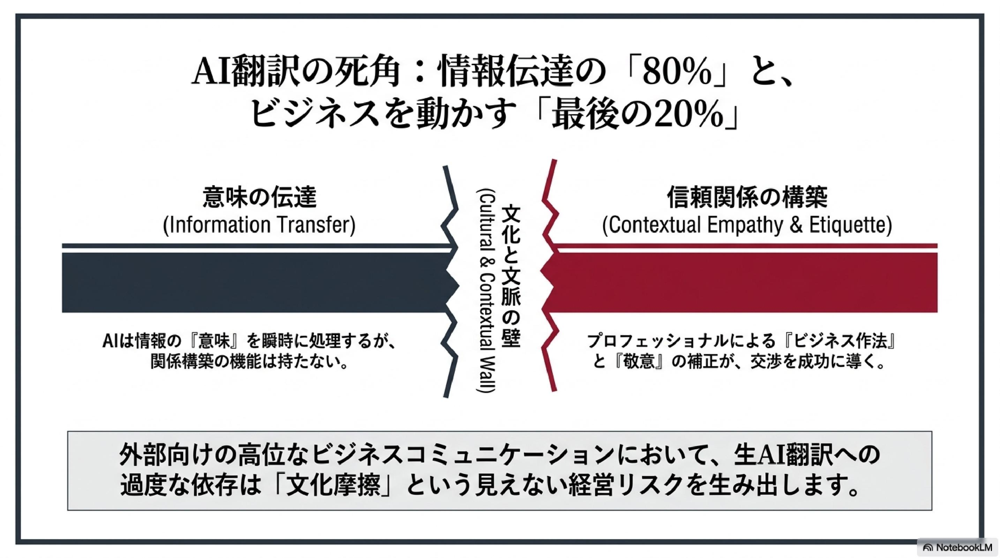
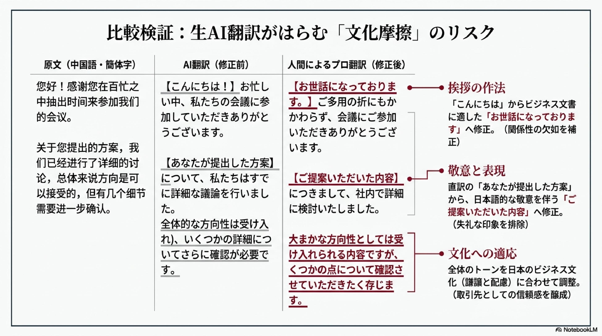
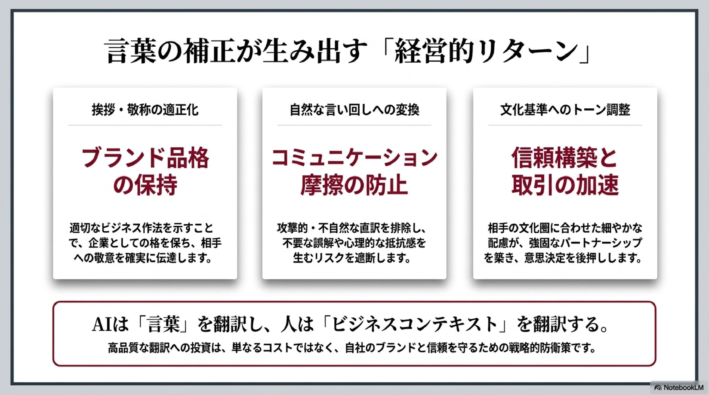

# 📂 実績・翻訳サンプル

実際の翻訳・校正の質を確認していただけるサンプルをご紹介します。

---

## Before / After：AI翻訳 → 人間による修正

### サンプル①：ビジネスメール（中国語 → 日本語）

<!-- NotebookLMスライドをJPGで挿入する場所 -->

**原文（中国語・簡体字）：**
> 您好！感谢您在百忙之中抽出时间来参加我们的会议。关于您提出的方案，我们已经进行了详细的讨论，总体来说方向是可以接受的，但有几个细节需要进一步确认。

**AI翻訳（修正前）：**
> こんにちは！お忙しい中、私たちの会議に参加していただきありがとうございます。あなたが提出した方案について、私たちはすでに詳細な議論を行いました。全体的な方向性は受け入れられますが、いくつかの詳細についてさらに確認が必要です。

**人間による修正後：**
> お世話になっております。ご多用の折にもかかわらず、会議にご参加いただきありがとうございます。ご提案いただいた内容につきまして、社内で詳細に検討いたしました。大まかな方向性としては受け入れられる内容ですが、いくつかの点について確認させていただきたく存じます。

**修正のポイント：**
- 「こんにちは」→ ビジネス文書に適した「お世話になっております」
- 「あなたが提出した方案」→ 日本語的な「ご提案いただいた内容」
- 全体のトーンを日本のビジネス文化に合わせて調整

---

### サンプル②：文学・随筆（中国語 → 日本語）

**原文（中国語・繁體字）：**
> 秋風吹過，樹葉開始變黃，我忽然想起了故鄉的那條老街，街邊的桂花香味，還有媽媽做的飯菜。

**AI翻訳（修正前）：**
> 秋風が吹いて、葉が黄色くなり始め、私は突然故郷の古い通りを思い出した。通りのキンモクセイの香り、そして母が作った料理。

**人間による修正後：**
> 秋風が通り過ぎると、木の葉が少しずつ色づき始めた。ふと、故郷のあの古い路地を思い出す。道沿いに漂うキンモクセイの香り、そして母の手料理の温もり。

**修正のポイント：**
- 文語的な美しさを日本語でも再現
- 「突然」→ 「ふと」（日本語らしい余韻）
- 「作った料理」→ 「手料理の温もり」（感情を補完）

---

### サンプル③：技術文書（日本語 → 中国語）

**原文（日本語）：**
> 本製品は、高温多湿の環境での使用を避けてください。電源コードが損傷している場合は、直ちに使用を中止し、販売店にお問い合わせください。

**AI翻訳（修正前）：**
> 请避免在高温高湿环境中使用本产品。如果电源线损坏，请立即停止使用并联系销售店。

**人間による修正後：**
> 请勿在高温潮湿的环境中使用本产品。若发现电源线损坏，请立即停止使用，并与销售商联系。

**修正のポイント：**
- 「高温高湿」→ 「高温潮湿」（より自然な表現）
- 指示文の語尾を統一し、技術文書として適切なトーンに調整

---

## 📊 対応実績（概要）

| ジャンル | 件数 |
|----------|------|
| ビジネス文書・契約書 | 1300 件 |
| 医療文書 | 720 件 |
| 書籍・出版物 | 1 件 |
| 電子書籍（著作権切れ） | 2 冊 |
| 技術文書（鉄道関連）・マニュアル（機械） | 320 件 |

---

<!-- 実績スライド挿入場所 -->
<!--  -->
<!-- Google tag (gtag.js) -->

---

[💼 サービスと料金を見る](../services/README.md)　　[📩 依頼・相談する](../contact.md)
