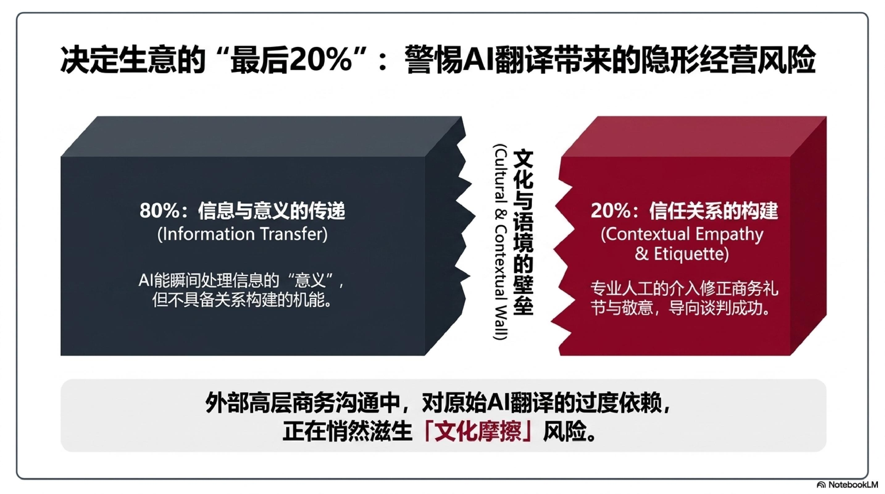
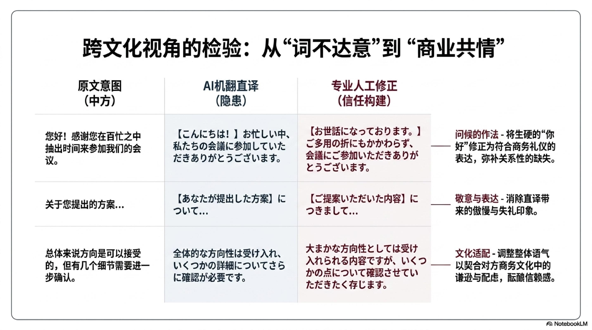
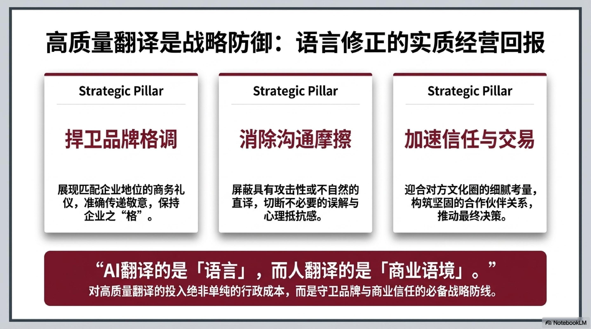

# 💼 服务内容与价格

[📩 委托翻译・咨询报价](contact.md)

---

## 方案比较

| | 全人工翻译 | AI翻译＋人工校对 | 仅校对 |
|---|---|---|---|
| **质量** | ★★★★★ | ★★★★☆ | ★★★★★ |
| **价格** | 可商量 |
| **交稿时间** | 3〜7个工作日 | 1〜3个工作日 | 1〜2个工作日 |
| **适合场景** | 合同、书籍、说明书 | 博客、SNS、内部资料 | 提升现有译文质量 |

---

## 🔵 方案①：全人工翻译

从头到尾由专业译者手工翻译，充分处理语气、文化背景和专业术语。

### 收费标准

| 方向 | 单价 |
|------|------|
| 中文 → 日文 | **(日元)¥2,880～ / 400字** |


---

## 🟡 方案②：AI翻译＋人工校对（低价）

由AI工具生成初稿后，专业译者全文审校修改。兼顾质量与成本。
<!-- NotebookLMで作成したBefore/After比較スライドをJPGで挿入 -->




### 收费标准

| 方向 | 单价 |
|------|------|
| 中文 → 日文 | **(日元)¥2,000～ / 400字** |
| 日文 → 中文 | **(日元)¥2,000～ / 400字** |

> ※ 约为全人工翻译价格的 **60〜70%**

---

## 🟢 方案③：仅校对

对您自行翻译或AI翻译的文本进行润色，使其达到母语者水准。

### 收费标准

| 字数 | 价格 |
|------|------|
| 1,000字以内 | **(日元)¥3,500（固定价）** |
| 1,001字以上 | **(日元)¥1,400- / 400字** |

---

## 📋 委托流程

```
① 通过联系表单发送原文・用途・希望交稿日期
        ↓
② 24小时内回复报价与交稿时间
        ↓
③ 确认后开始工作
        ↓
④ 发送工作完成的通知
        ↓
⑤ 付款（银行转账 / PayPal / 其他）
        ↓
⑥ 交稿＋免费修改一次
```

---

[📩 立即委托・咨询](contact.md)
<!-- Google tag (gtag.js) -->
<script async src="https://www.googletagmanager.com/gtag/js?id=G-HT66YG18J9"></script>
<script>
  window.dataLayer = window.dataLayer || [];
  function gtag(){dataLayer.push(arguments);}
  gtag('js', new Date());

  gtag('config', 'G-HT66YG18J9');
</script>