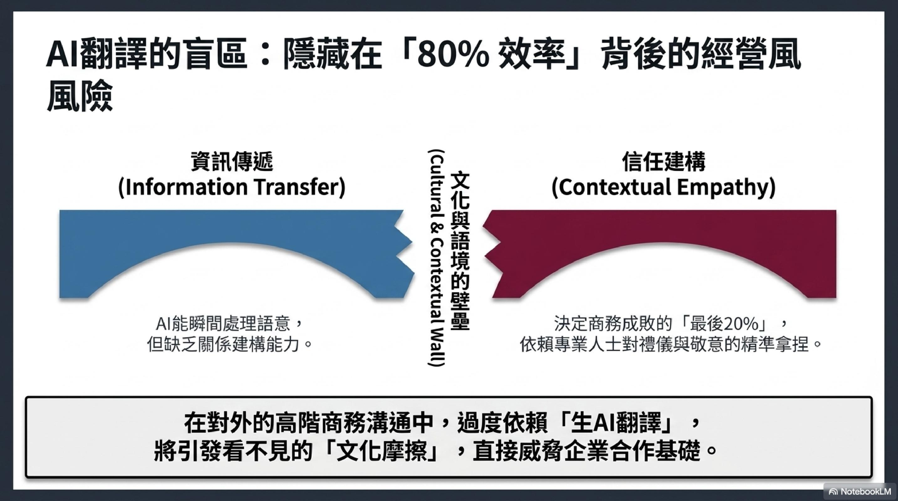

# 📂 实绩・翻译样例

以下是AI翻译与人工修改前后的实际对比示例。

---

## Before / After：AI翻译 → 人工修改

### 样例①：文學散文（繁體中文 → 日文）

**原文（繁體中文）：**
> 秋風吹過，樹葉開始變黃，我忽然想起了故鄉的那條老街，街邊的桂花香味，還有媽媽做的飯菜。

**AI翻译（修改前）：**
> 秋風が吹いて、葉が黄色くなり始め、私は突然故郷の古い通りを思い出した。通りのキンモクセイの香り、そして母が作った料理。

**人工修改后：**
> 秋風が通り過ぎると、木の葉が少しずつ色づき始めた。ふと、故郷のあの古い路地を思い出す。道沿いに漂うキンモクセイの香り、そして母の手料理の温もり。

**修改要點：**
> 「突然」→「ふと」（更具日語韻味的表達）
> 「作った料理」→「手料理の温もり」（補充情感溫度）
> 整體還原文學散文的意境與節奏
---
## 📊 翻譯實績（概覽）

| 類別 | 數量 |
|----------|--------|
| 商務文件・郵件 | 1300 projects |
| 網站・落地頁 | 720 projects |
| 書籍・出版物 | 1 titles |
| 電子書（著作權到期） | 2 titles |
| 技術文件・說明書 | 320 projects |

---

[💼 查看服务与价格](../services/README.md)　　[📩 委托・咨询](../contact.md)
<!-- Google tag (gtag.js) -->

